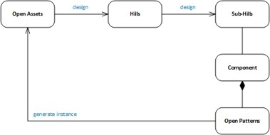

<h3>Evolving Assets using Design Thinking:</h3>

<h4>Open Assets</h4>
* <p_desc>Work with end users and researchers to define use cases</p_desc>
* <p_desc>Organize thoughts under 3 Hills and Foundation</p_desc>
* <p_desc>Define Sponsor Users for getting feedback from playbacks and continuous improvement of the design</p_desc>
* <p_desc>Define Components / features</p_desc>
* <p_desc> Define Open Projects, Timelines, Iterations, Playbacks, Milestones </p_desc>

<h4>Open Patterns</h4>
* <p_desc>Identify common patterns within the code and documentation from multiple assets</p_desc>
* <p_desc>Patterns may be identified and developed by the Offering Management and other teams to accelerate Open Project development</p_desc>
* <p_desc>Exemplars are patternized into templates that can generate code, document, etc. for Open Assets</p_desc>
