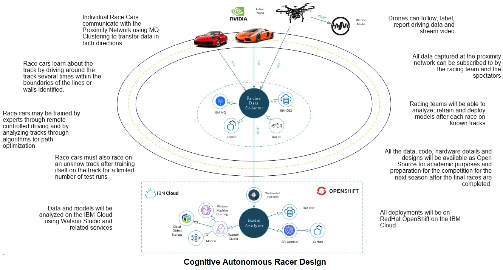

**Designing a Open and Secured framework for Autonomous Racing Car**
 Most racing car scenarios are built with manual racing controls. This project is aimed at autonomous racing using advanced Machine Learning and Deep Learning algorithms.
 Racing cars have always tested the limits of our understanding of path optimizations along with acceleration and declaration of the vehicle on a winding track. Once multiple racing cars are introduced the driver of the vehicle has to not only optimize the path but avoid any obstacles (cars) in the path. This make it a very complex problem to solve for an autonomous vehicle. This project aims to take up this challenge in a phased approach.

**Components Used**
 ***MQTT Protocol-***  used to connect to Proximity n/w using MQTT Protocol to the MQ Queue Manager
 ***Watson IoT Platform-*** used to analyze the data
 ***COS-*** Cloud Object Storage used to store the data
 ***Watson Studio-*** used to build and train models using the data obtained after every run. Also used to build alternate models and Auto AI to check which models work better
 ***Carbon-*** library that can work with frameworks like REACT, VUE, etc.
 ***Node.js-*** server on which Javascript can run
 ***JAX-RS-*** framework to work on REST API in Java
 ***Open Liberty-*** server to run the Java code on

