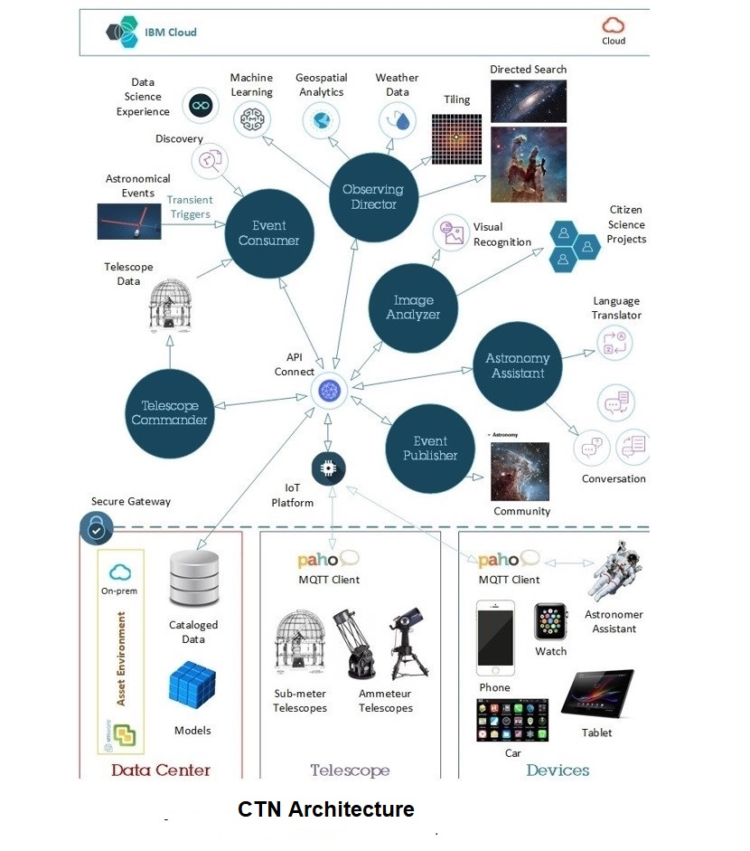

Telescopic follow-up of transient astronomical events is one of the most desirable and scientifically useful activities in modern observational astronomy. From a scientific perspective, pinpointing a transient event can be essential for discovering more about the source, either by directing more powerful telescopes to observe, or to maintain a near continuous record of observations as the transient evolves. Very often transients are poorly localized on the sky and telescopes have a limited field of view thus pin-pointing the transient source is often a daunting task. Perhaps most importantly, the number of large telescopes on the planet is small, and they cannot be commandeered to randomly search for every transient of interest.

The Cognitive Telescope Network (CTN) will be a framework that takes notifications of transient events and intelligently instructs a network of sub-meter telescopes mapped into a grid and observe a large region of the sky that likely contains the transient event, based on the geolocation, weather and properties of the individual telescopes. 
 The goal of CTN is to collect the data from this network of small telescopes, evaluate and classify that data to identify the most likely candidates for the transient being hunted and deliver the results to the astronomer community for further analysis by larger telescopes for directed and focused observations.
**Further Details for CTN Project ** <a href="http://ccode.ibm-asset.com/cas/centers/chicago/projects/research/ctn/"  target="_blank"> available here</a>

 
 ***CTN Development Areas***
 - UI using Carbon Design System with React on Node.js
 - REST API development using JAX-RS in Java
 - Python 3 development
 - Chatbot development using Watson Conversation, Discovery, Knowledge Studio
 - DevOps deployments using Terraform and Tekton Pipeline on OpenShift
 - Documentation using MkDocs published on Git

 ***Telescope Commander - ***enables remote controlling of telescopes in the n/w through IoT from anywhere in the world as an interconnected device
 -The communication between the UI and the middle tier uses REST API
 -Intercommunication between different components are also achieved using APIs exposed for each of the components.
 -API Test suite for Postman was also created for testing of the API.

 ***Observing Director - ***this component contains placement algorithm for telescopes to be arranged based on optimized criteria for Tiling and Directed Search
 - The UX calls the API that filters telescopes based on geo-location, weather and other factors and sends commands to the telescope commander component 

 ***Astronomy Assistant - ***this component contains cognitive user interface to interact with the n/w, both for accessing the knowledge base and for sending commands
 - creates a chatbot interface to the application
 - The design calls for the building of a web, social media and journal crawler to parse, analyze and learn from the information to enrich the corpus and the astronomical models.

 ***Devops Deployment - ***
 **Terraform Script** - used for designing and implementation of Infrastructure as Code for AOT CTN initiative. This allows for repeatable creation of clusters and control of current state of infrastructure
 **Tekton Pipeline** - triggers implemented to automatically build and deploy the services to OpenShift cluster on developer committing code to the code repository.
  - Source code is built into image using source to image (S2I) without need of a Dockerfile and image is pushed to IBM Cloud Container registry(ICR)
  - Image are pulled from ICR to image streams and deployed to OpenShift clusters
