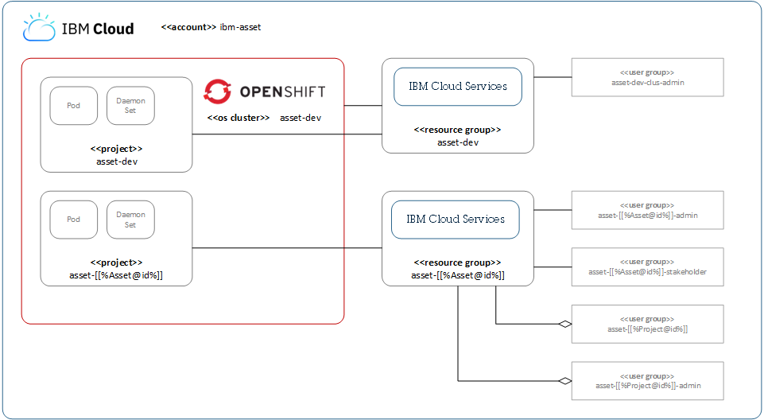

OpenShift is a containerization platform and in order to make out application easy to deploy in OpenShift, we need to set it up to be containerized.
 Each asset is deployed in their own specific <b>OpenShift Cluster</b> for the asset-dev environment. In the cluster, each asset with their individual asset-Id's are deployed in individual Pod, thus owning its entire port space, and containers within pods can share their local storage and networking. Also a <b>daemonset</b> is used to run replicas of a pod on the specific node in  the OpenShift Container Platform cluster for the asset-dev environment.
  
<b>IBM Cloud Services</b>
  Users are added in specific user groups and are given access to the required services, by the Cluster Admin.
Based on their authorized access, the services can access the required Pods
