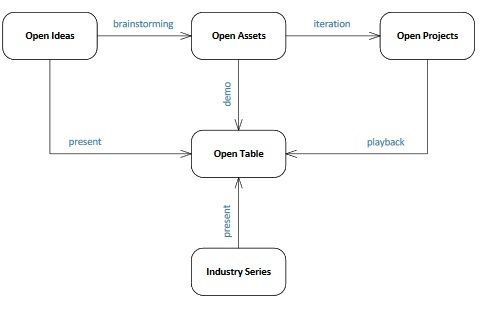

		 There can be Open Ideas which can come from 
Research Faculty
Offering Management
Development Team
Business Partners

 
Once the Idea gets Submitted, there will be a Brainstorming session on the same.
If it is a New Idea , then a New Asset will be opened, or Existing Asset will be updated.

If it is a new Idea, Design Thinking will get enabled resulting in the generation of a New Asset