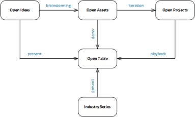

<h4>Open Ideas</h4>
* <p_desc>Submitter Team (comprising of Faculty/Offering Management/Dev Team/Biz Partners) can submit ideas into Ideation Blog</p_desc>
* <p_desc>Evaluation of the idea / Brainstorming Sessions</p_desc>
	* <p_desc>If this is New Asset then Define it in Box and Jazz Hub</p_desc>
	* <p_desc>If this is Old Asset then initiate Design Thinking</p_desc>
* <p_desc>Finalization of the idea</p_desc>
* <p_desc>Starting Projects/Assets/Paper/Patent</p_desc>

<h4>Open Assets</h4>
* <p_desc>New assets created based on the Idea</p_desc>
* <p_desc>New Feature created in an existing Asset</p_desc>
* <p_desc>Added to the portfolio</p_desc>

<h4>Open Projects</h4>
* <p_desc>Open Projects are created to develop features or components on Assets</p_desc>
* <p_desc>Open Projects may be run independently with Asset association</p_desc>
* <p_desc>Open Projects are associated with a Timeline and may run multiple Iterations with single/multiple teams</p_desc>

<h4>Open Events: Open Table</h4>
* <p_desc>Schedule Calls for Ideas, Assets, Projects</p_desc>
* <p_desc>Demos and Playbacks</p_desc>
* <p_desc>Industry Leaders presenting on the Call for Discussions and building the ecosystem</p_desc>